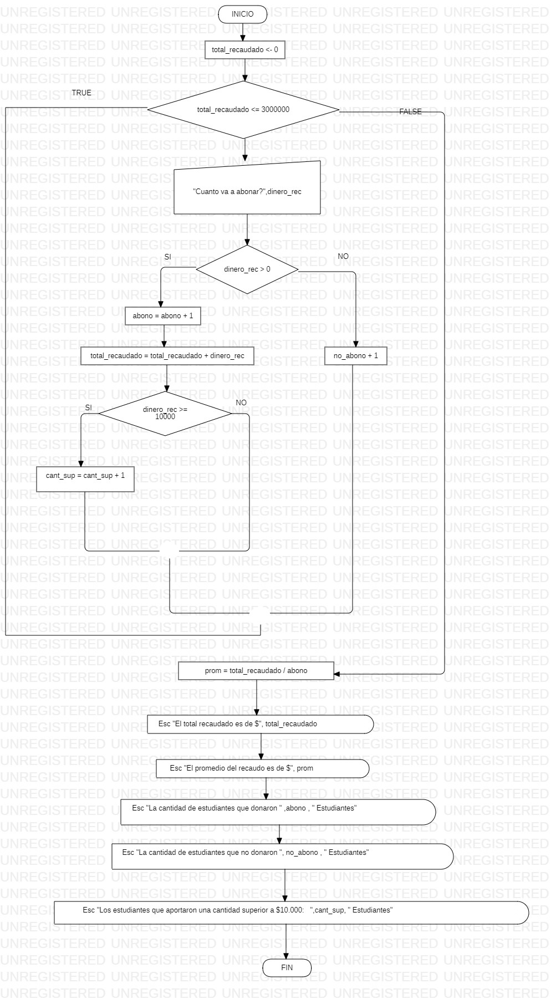

# Algoritmo

~~~

Sub eventoescolar()
    
    abono = 0
    no_abono = 0
    cant_sup = 0
    total_recaudado = 0
    
    While total_recaudado <= 3000000
        dinero_rec = InputBox("Cuanto va a abonar?")
        If dinero_rec > 0 Then
            abono = abono + 1
            total_recaudado = total_recaudado + dinero_rec
            If dinero_rec >= 10000 Then
                cant_sup = cant_sup + 1
            End If
        Else
            no_abono = no_abono + 1
        End If
    Wend
    
    prom = total_recaudado / abono
    MsgBox "El total recaudado es de $" & total_recaudado
    MsgBox "El promedio del recaudo es de $" & prom
    MsgBox "La cantidad de estudiantes que donaron " & "(" & abono & ")" & " Estudiantes"
    MsgBox "La cantidad de estudiantes que no donaron " & "(" & no_abono & ")" & " Estudiantes"
    MsgBox "Los estudiantes que aportaron una cantidad superior a $10.000:   " & "(" & cant_sup & ")" & " Estudiantes"
        
End Sub

~~~

# Diagrama de Flujo

