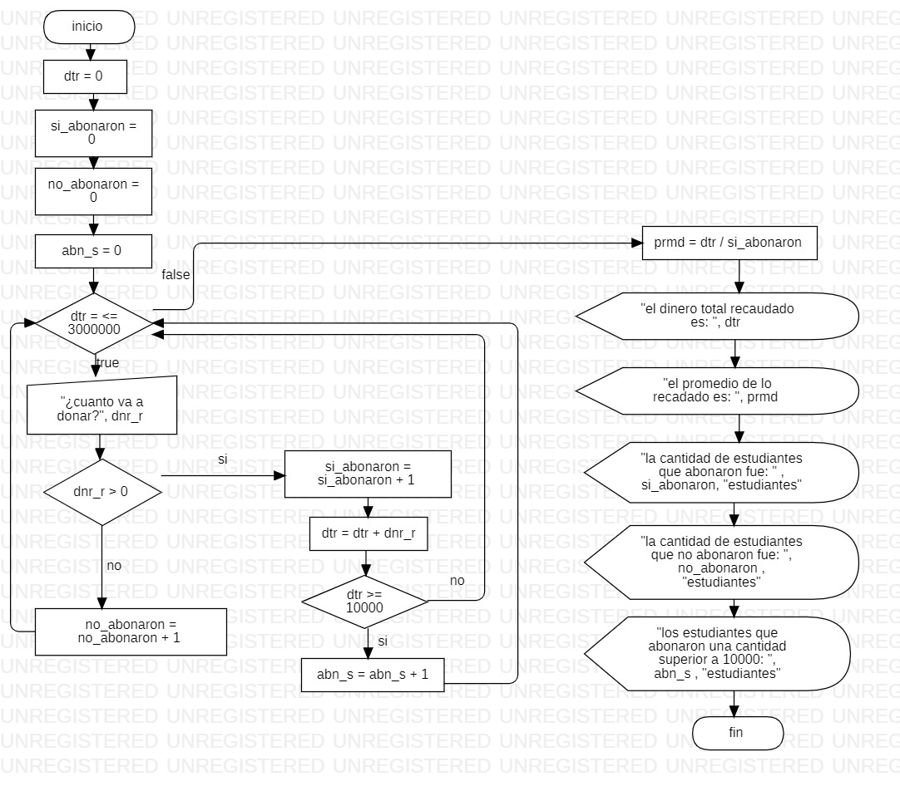

```
Sub evento_escolar()
     dtr = 0
     si_abonaron = 0
     no_abonaron = 0
     abn_s = 0
     While dtr <= 3000000
         dnr_r = Int(InputBox("cuanto va a donar"))
         If dnr_r > 0 Then
            si_abonaron = si_abonaron + 1
            dtr = dtr + dnr_r
            If dnr_r >= 10000 Then
               abn_s = abn_s + 1
            End If
         Else
         
          no_abonaron = no_abonaron + 1
         End If
      Wend
      prmd = dtr / si_abonaron
      MsgBox "el dinero total recaudado es: " & dtr
      MsgBox "el promedio de lo recaudado es: " & prmd
      MsgBox "la cantidad de estudiantes que abonaron fue: " & "(" & si_abonaron & ")" & "estudiantes"
      MsgBox "la cantidad de estudiantes que no abonaron fue: " & "(" & no_abonaron & ")" & "estudiantes"
      MsgBox "los estudiantes que abonaron una cantidad superior a 10.000: " & "(" & abn_s & ")" & "estudiantes"
      
End Sub
```

