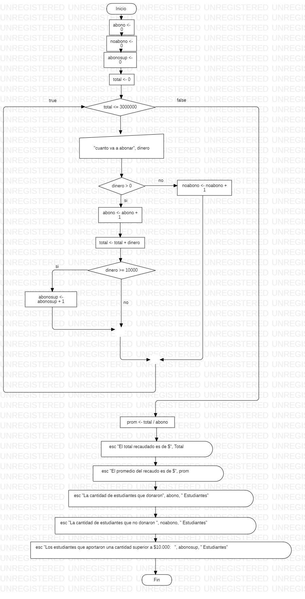

inicio   
    p = 0
    x = 0
    aps = 0
    Total = 0
    
    While Total <= 3000000
        dinero = Int(InputBox("cuanto va a abonar"))
        If dinero > 0 Then
            p = p + 1
            Total = Total + dinero
            If dinero >= 10000 Then
                aps = aps + 1
            End If
        Else
            x = x + 1
        End If
    Wend
    
    prom = Total / p
    MsgBox "el total recaudado es de" & Total
    MsgBox "el promedio del recaudo es de" & prom
    MsgBox "la cantidad de estudiantes que donaron" & "(" & p & ")" & "estudiantes"
    MsgBox "la cantidad de estudiantes que no donaron" & "(" & x & ")" & "estudiantes"
    MsgBox "la cantidad de estudiantes que aportaron una cantidad superior a $10.000:" & "(" & aps & ")" & "estudiantes"
End Sub
