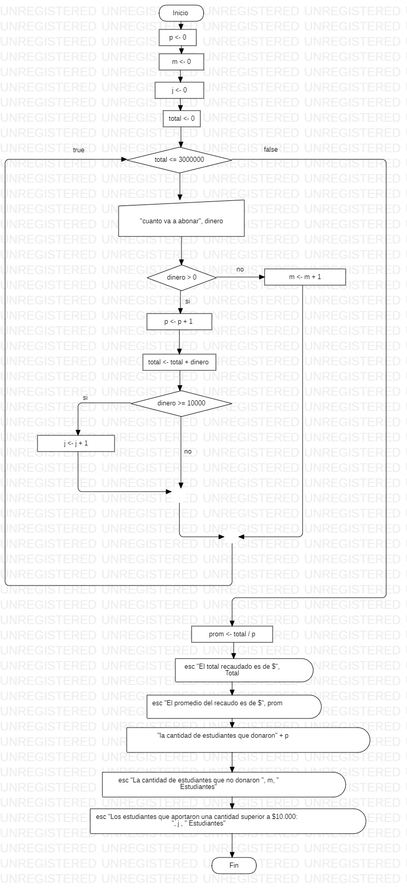

```
Sub trabajo()
     p = 0
    m = 0
    j = 0
    Total = 0
     While Total <= 3000000
      dinero = Int(InputBox("cuanto va a aportar"))
       If dinero > 0 Then
        p = p + 1
        Total = Total + dinero
        If dinero >= 10000 Then
         j = j + 1
       
       End If
     Else
        n = n + 1
       End If
     Wend
     prom = Total / p
      MsgBox "el total reaudado es de" & Total
      MsgBox "el promedio del recaudo es" & prom
      MsgBox "la cantidad de estudiantes que donaron" & "(" & p & ")" & "estudiantes"
      MsgBox "las estudiantes que no donaron" & "(" & m & ")" & "estudiantes"
      MsgBox "los estudiantes que abonaron mas de lo superior a 100000:" & " (" & j & ")" & "estudiantes"
      
            
End Sub
```

