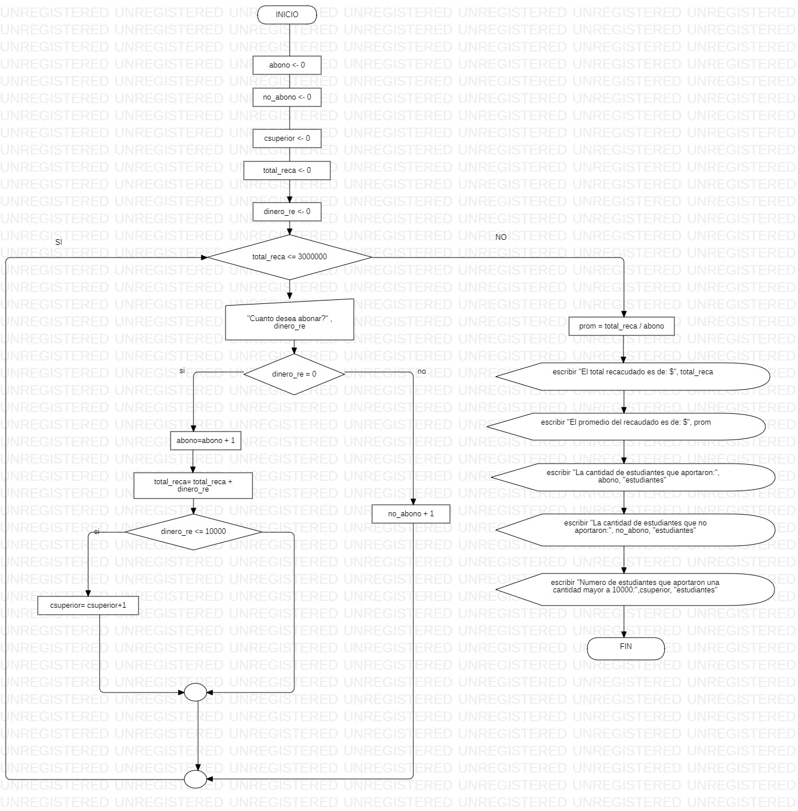

~~~ 

Sub evento_escolar()

    abono = 0
    no_abono = 0
    csuperior = 0
    total_reca = 0
    dinero_re =0

    While total_reca <= 3000000
        dinero_re = InputBox("Cuanto desea a abonar?")
        If dinero_re > 0 Then
            abono = abono + 1
            total_reca = total_reca + dinero_re
            If dinero_re >= 10000 Then
                csuperior = csuperior + 1
            End If
        Else
            no_abono = no_abono + 1
        End If
    Wend
    
    prom = total_reca / abono
    MsgBox "El total recaudado es de $" & total_reca
    MsgBox "El promedio del recaudo es de $" & prom
    MsgBox "La cantidad de estudiantes que donaron " & "(" & abono & ")" & " Estudiantes"
    MsgBox "La cantidad de estudiantes que no donaron " & "(" & no_abono & ")" & " Estudiantes"
    MsgBox "Los estudiantes que aportaron una cantidad superior a $10.000:   " & "(" & csuperior & ")" & " Estudiantes"
End Sub

~~~ 

 
