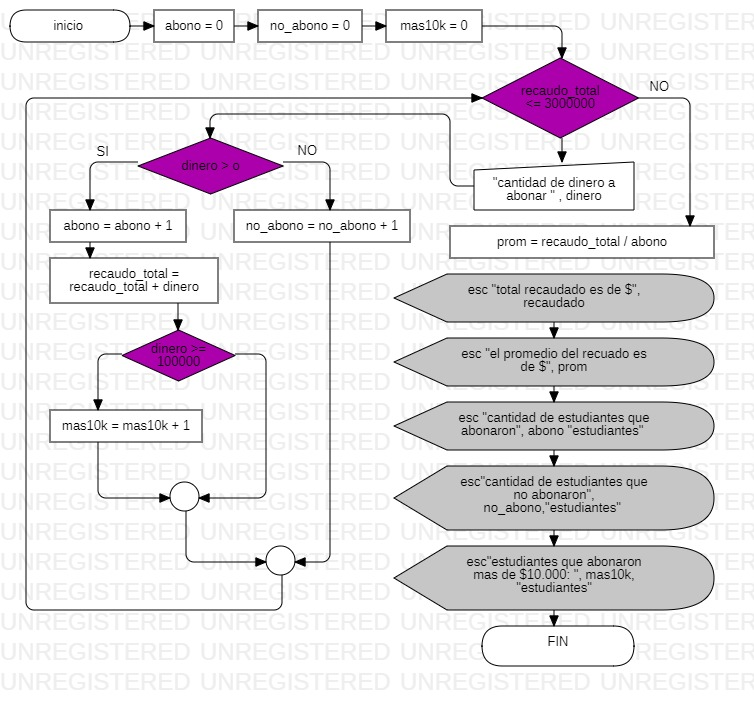

~~~
Sub sena()

    abono = 0
    no_abono = 0
    mas10k = 0
    Total = 0
    
    While Recaudo_final <= 3000000
        dinero = Int(InputBox("cantidad de dinero a abonar"))
        If dinero > 0 Then
            abono = abono + 1
            Recaudo_final = Recaudo_final + dinero
            If dinero >= 10000 Then
                mas10k = mas10k + 1
            End If
        Else
            no_abono = no_abono + 1
        End If
        
    Wend
    
    prom = Recaudo / abono
    MsgBox "total recaudado es de $" & Recaudo_final
    MsgBox "El promedio del recaudo es de $" & prom
    MsgBox "cantidad de estudiantes que abonaron " & "(" & abono & ")" & " Estudiantes"
    MsgBox "cantidad de estudiantes que no abonaron " & "(" & no_abono & ")" & " Estudiantes"
    MsgBox "estudiantes que abonaron mas de $10.000:   " & "(" & mas10k & ")" & " Estudiantes"
        
End Sub
~~~
