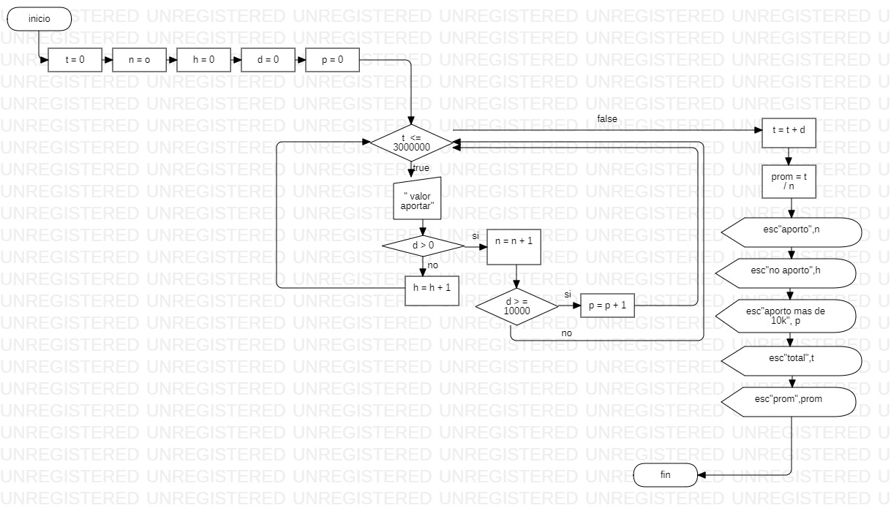

Sub inicio()
  t = 0
  n = 0
  h = 0
  d = 0
  p = 0
  While t <= 3000000
   d = Int(InputBox("valor aportar"))
     If d > 0 Then
        n = n + 1
      If d >= 10000 Then
        p = p + 1
    End If
   Else
     h = h + 1
    End If
  Wend
  t = t + d
  prom = t / n
  MsgBox "aporto:" & n
  MsgBox "no aporto:" & h
  MsgBox "aporto mas de 10k:" & p
  MsgBox "total:" & t
  MsgBox "prom:" & prom
  
End Sub
