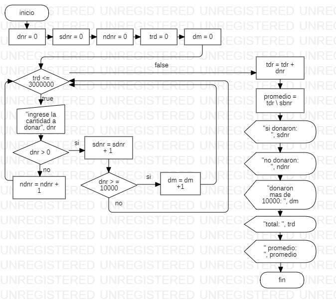

```
Sub recolecta()
    dnr = 0
    sdnr = 0
    ndnr = 0
    trd = 0
    dm = 0
    
    While trd <= 3000000
        dnr = Int(InputBox("Ingrese la cantidad a donar"))
        If dnr > 0 Then
            sdnr = sdnr + 1
           If dnr >= 10000 Then
              dm = dm + 1
           End If
        Else
         ndnr = ndnr + 1
        End If
        
    Wend
    
    trd = trd + dnr
    promedio = trd / sbnr
    
    MsgBox "si donaron: " & sdnr
    MsgBox "no donaron: " & ndnr
    MsgBox "donaron mas de 10000: " & dm
    MsgBox "total: " & trd
    MsgBox "promedio: " & promedio

End Sub
```
