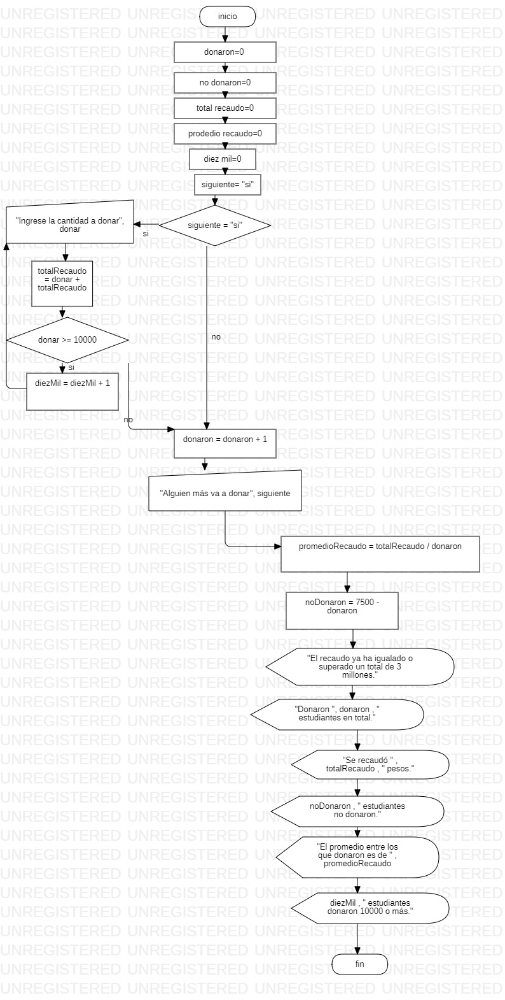

Sub recolecta()
    donaron = 0
    noDonaron = 0
    totalRecaudo = 0
    promedioRecaudo = 0
    diezMil = 0
    siguiente = "si"

    While siguiente = "si" And totalRecaudo < 3000000
        donar = Int(InputBox("Ingrese la cantidad a donar"))
        totalRecaudo = donar + totalRecaudo
        If donar >= 10000 Then
            diezMil = diezMil + 1
        End If
        donaron = donaron + 1
        siguiente = InputBox("Alguien más va a donar?")
    Wend
    promedioRecaudo = totalRecaudo / donaron
    noDonaron = 7500 - donaron
    
    MsgBox "El recaudo ya ha igualado o superado un total de 3 millones."
    MsgBox "Donaron " & donaron & " estudiantes en total."
    MsgBox "Se recaudó " & totalRecaudo & " pesos."
    MsgBox noDonaron & " estudiantes no donaron."
    MsgBox "El promedio entre los que donaron es de " & promedioRecaudo
    MsgBox diezMil & " estudiante donaron 10.000 o más."

End Sub

