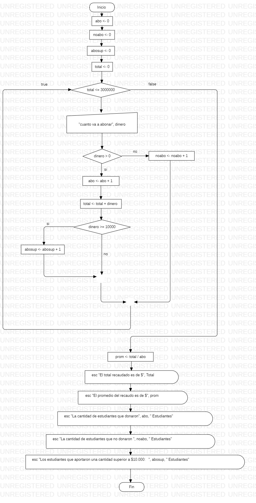

``` 
Sub ejercicio()
    abo = 0
    noabo = 0
    abosup = 0
    Total = 0
    
    While Total <= 3000000
        dinero = Int(InputBox("Cuanto va a abonar?"))
        If dinero > 0 Then
            abo = abo + 1
            Total = Total + dinero
            If dinero >= 10000 Then
                abosup = abosup + 1
            End If
        Else
            noabo = noabo + 1
        End If
    Wend
    
    prom = Total / abo
    MsgBox "El total recaudado es de $" & Total
    MsgBox "El promedio del recaudo es de $" & prom
    MsgBox "La cantidad de estudiantes que donaron " & "(" & abo & ")" & " Estudiantes"
    MsgBox "La cantidad de estudiantes que no donaron " & "(" & noabo & ")" & " Estudiantes"
    MsgBox "Los estudiantes que aportaron una cantidad superior a $10.000:   " & "(" & abosup & ")" & " Estudiantes"
        
End Sub
``` 

