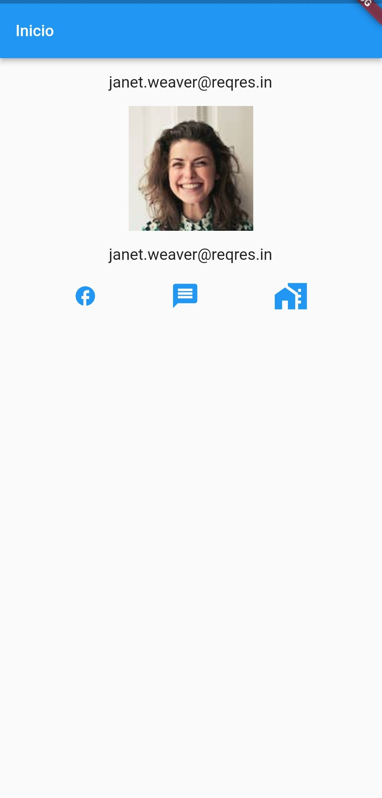

# Primera Aplicacion en Flutter

- Main
~~~~
import 'package:flutter/material.dart';
import 'templates/template.dart';
import 'models/user.dart';
import 'package:http/http.dart' as http;

void main() {
  runApp(Sena());
}

class Sena extends StatelessWidget{
  @override
  Widget build(BuildContext context) {
    return MaterialApp(
      title: 'Mi primera App',
      home: Scaffold(
        appBar: AppBar(title: Text('REGISTRO'),
          backgroundColor: Colors.red),
          backgroundColor: Colors.white,
        body: FutureBuilder<User>(
          future: getUser(),
          builder: (context, snapshot) {
            if (snapshot.connectionState == ConnectionState.done){
              User user = snapshot.data as User;
              return Template(user:user);
      }
      return Center(child: CircularProgressIndicator());
    },
  ),
      ),
  );
  }

    Future<User> getUser() async {
      final url = Uri.https('reqres.in', '/api/users/11');
      final response = await http.get(url);
        return User(response.body); 
      }
  }    
~~~~
- Template
~~~~
import 'package:flutter/material.dart';
import 'package:flutter_application_1/models/user.dart';

class Template extends StatelessWidget {
  const Template({
    Key? key,
    required this.user,
  }) : super(key: key);

final User user;

  @override
  Widget build(BuildContext context) {
    return Column(
          children: [
            SizedBox(height: 15.0),
            Text(user.nombre!, style: TextStyle(fontSize: 20.0 )),
            SizedBox(height: 15.0,),
            Image(
      image: NetworkImage(user.avatar!, scale: 0.9),
    ),
            SizedBox(height: 20.0,),
            Text(user.email!,style: TextStyle(fontSize: 18.0 )),
            SizedBox(height: 20.0,),
            Row(
      mainAxisAlignment: MainAxisAlignment.spaceAround,
      children: const <Widget>[
        Icon(
          Icons.facebook,
          color: Colors.red,
          size: 24.0,
          semanticLabel: 'Text to announce in accessibility modes',
        ),
        Icon(
          Icons.phone,
          color: Colors.red,
          size: 30.0,
        ),
        Icon(
          Icons.email,
          color: Colors.red,
          size: 36.0,
        ),
      ],
    )
        ]
        );
  }
}
~~~~

-User
~~~~
import 'dart:convert' as convert;

class User{
  String? nombre;
  String? avatar;
  String? email;

  User(String json){
    final jsonResponse = convert.jsonDecode(json);
    nombre = jsonResponse["data"]["first_name"];
    avatar = jsonResponse["data"]["avatar"];
    email = jsonResponse["data"]["email"];

  }
}
~~~~
