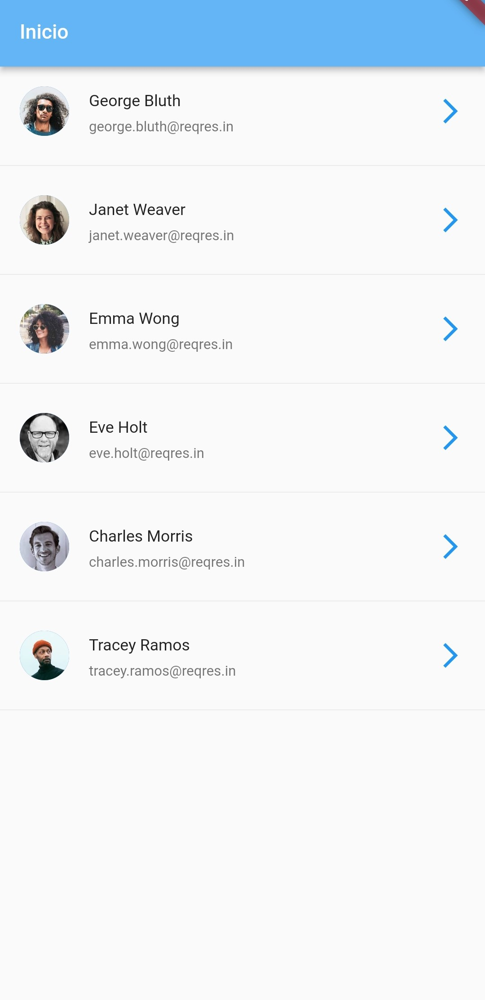

# Segunda Aplicacion en Flutter

{width='100px'}
- Main

~~~~
import 'package:flutter/material.dart';
import 'models/user.dart';
import 'package:http/http.dart' as http;
import 'templates/template.dart';
void main() => runApp(Sena());

class Sena extends StatelessWidget {
  @override
  Widget build(BuildContext context) {
    return MaterialApp(
      title: 'Mi App',
      home: Scaffold(
          appBar: AppBar(title: Text('Usuarios'), backgroundColor: Colors.blue[300],),
          body: FutureBuilder<List<User>>(
            future: getData(),
            builder: (context, snapshot) {
              if (snapshot.connectionState == ConnectionState.done) {
                List<User> users = snapshot.data!;
                return ListView.builder(
                    itemCount: users.length,
                    itemBuilder: (BuildContext context, index) {
                      final user = users[index];
                      return ItemData(user: user);
                    });
              }
              return Center(child: CircularProgressIndicator());
            },
          )),
    );
  }

  Future<List<User>> getData() async {
    final url = Uri.https('reqres.in', '/api/users');
    final res = await http.get(url);
    print('Respuesta ${res.body}');
    return userFromJson(res.body);
  }
}
~~~~

- Template

~~~~
import 'package:flutter/material.dart';
import '../models/user.dart';

class ItemData extends StatelessWidget {
  final User user;
  const ItemData({
    Key? key,
    required this.user,
  }) : super(key: key);
  @override
  Widget build(BuildContext context) {
    return Column(
      children: [
        ListTile(
          title: Text('${user.firstName!} ${user.lastName!}'),
          subtitle: Text(user.correoElectrnico!),
          leading: CircleAvatar(backgroundImage: NetworkImage(user.avatar!),),
          trailing: const Icon(Icons.arrow_forward_ios, color: Colors.blue,),
        ),
        Divider(),
      ],
    );
  }
}

~~~~

- User

~~~~
import "package:flutter_application_1/main.dart";
import 'dart:convert';

List<User> userFromJson(String str) => List<User>.from(json.decode(str)['data'].map((x) => User.fromJson(x)));
class User {
  User({
    this.correoElectrnico,
    this.firstName,
    this.lastName,
    this.avatar,
  });
  String? correoElectrnico;
  String? firstName;
  String? lastName;
  String? avatar;

  factory User.fromJson(Map<String, dynamic> json) => User(
    correoElectrnico: json["email"],
    firstName: json["first_name"],
    lastName: json["last_name"],
    avatar: json["avatar"],
  );
}
~~~~
