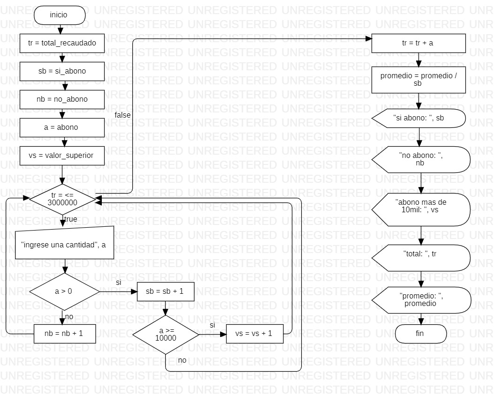

```
Sub recolecta()
 tr = total_recaudado
 sb = si_abono
 nb = no_abono
 a = abono
 vs = valor_superior
 
 While tr <= 3000000
   a = Int(InputBox("ingrese una cantidad"))
     If a > 0 Then
          sb = sb + 1
       If a >= 10000 Then
          vs = vs + 1
       End If
     Else
          nb = nb + 1
     End If
     
 Wend
 
 tr = tr + a
 promedio = tr / sb
 MsgBox "si abono: " & sb
 MsgBox "no abono: " & nb
 MsgBox "abono mas de 10mil: " & vs
 MsgBox "total: " & tr
 MsgBox "promedio: " & promedio
 
 
End Sub

```
